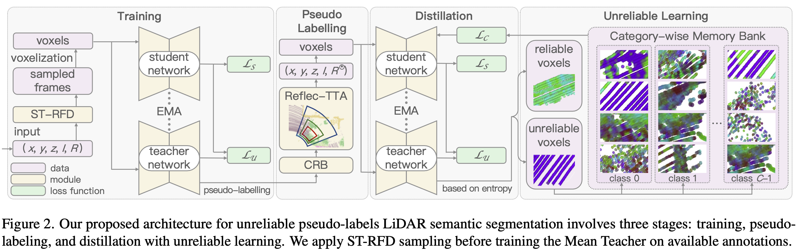

[](https://github.com/l1997i/lim3d/blob/main/LICENSE)
<div align="center">
      &emsp;&emsp;&emsp;&emsp;
     <br>
</div> 


# 🔥 Less is More: Reducing Task and Model Complexity for 3D Point Cloud Semantic Segmentation [CVPR 2023]

[Li Li](https://luisli.org), [Hubert P. H. Shum](http://hubertshum.com/) and [Toby P. Breckon](https://breckon.org/toby/), In Proc. International Conference on Computer Vision and Pattern Recognition (CVPR), IEEE, 2023

[[project page](#)] [[pdf](#)] [[video](#)] [[poster](#)]

## News 

[2023/02/27] LiM3D was accepted at CVPR 2023!


> **Abstract**: Whilst the availability of 3D LiDAR point cloud data has significantly grown in recent years, annotation remains expensive and time-consuming, leading to a demand for semi-supervised semantic segmentation methods with application domains such as autonomous driving. Existing work very often employs relatively large segmentation backbone networks to improve segmentation accuracy, at the expense of computational costs. In addition, many use uniform sampling to reduce ground truth data requirements for learning needed, often resulting in sub-optimal performance. To address these issues, we propose a new pipeline that employs a smaller architecture, requiring fewer ground-truth annotations to achieve superior segmentation accuracy compared to contemporary approaches. This is facilitated via a novel Sparse Depthwise Separable Convolution module that significantly reduces the network parameter count while retaining overall task performance. To effectively sub-sample our training data, we propose a new Spatio-Temporal Redundant Frame Downsampling (ST-RFD) method that leverages knowledge of sensor motion within the environment to extract a more diverse subset of training data frame samples. To leverage the use of limited annotated data samples, we further propose a soft pseudo-label method informed by LiDAR reflectivity. Our method outperforms contemporary semi-supervised work in terms of mIoU, using less labeled data, on the SemanticKITTI (**59.5**@5%) and ScribbleKITTI (**58.1**@5%) benchmark datasets, based on a **2.3×** reduction in model parameters and **641×** fewer multiply-add operations whilst also demonstrating significant performance improvement on limited training data (*i.e.*, *Less is More*).




---

## Data Preparation

The `data` is organized in the format of `{SemanticKITTI}` U `{ScribbleKITTI}`.

```
sequences/
    ├── 00/
    │   ├── scribbles/
    │   │     ├ 000000.label
    │   │     ├ 000001.label
    │   │     └ .......label
    │   ├── labels/
    │   ├── velodyne/
    │   ├── image_2/
    │   ├── image_3/
    │   ├── times.txt
    │   ├── calib.txt
    │   └── poses.txt
    ├── 01/
    ├── 02/
    .
    .
    └── 21/
```

### SemanticKITTI
Please follow the instructions from [SemanticKITTI](http://www.semantic-kitti.org) to download the dataset including the KITTI Odometry point cloud data.

### ScribbleKITTI
Please download `ScribbleKITTI` [scribble annotations](https://data.vision.ee.ethz.ch/ouenal/scribblekitti.zip) and unzip in the same directory. Each sequence in the train-set (00-07, 09-10) should contain the `velodyne`, `labels` and `scribbles` directories.

Move the `sequences` folder or make a symbolic link to a new directoy inside the project dir called `data/`. Alternatively, edit the `dataset: root_dir` field of each config file to point to the sequences folder.

## Environment Setup

For the installation, we recommend setting up a virtual environment using `conda` or `venv`:

For conda,
```shell
conda env create -f environment.yaml
conda activate lim3d 
pip install -r requirements.txt
```

For venv,
```shell
python -m venv ~/venv/lim3d
source ~/venv/scribblekitti/bin/activate
pip install -r requirements.txt
```

Futhermore install the following dependencies:
- [pytorch](https://pytorch.org/get-started/previous-versions/#v1101) (tested with version `1.10.1+cu111`)
- [pytorch-lightning](https://www.pytorchlightning.ai/) (tested with version `1.6.5`)
- [torch-scatter](https://github.com/rusty1s/pytorch_scatter) (tested with version `2.0.9`)
- [spconv](https://github.com/traveller59/spconv) (tested with version `2.1.21`)

## Experiments

Our overall architecture involves three stages (Figure 2). You can reproduce our results through the scripts provided in the `experiments` folder: 

1. **Training**: we utilize reflectivity-prior descriptors and adapt the Mean Teacher framework to generate high-quality pseudo-labels. Runing with bash script: `bash experiments/train.sh`; 
2. **Pseudo-labeling**: we fix the trained teacher model prediction in a class-range-balanced manner, expanding dataset with Reflectivity-based Test Time Augmentation (Reflec-TTA) during test time. Runing with bash script: `bash experiments/crb.sh`, then save the pseudo-labels `bash experiments/save.sh`; 
3. **Distillation with unreliable predictions**: we train on the generated pseudo-labels, and utilize unreliable pseudo-labels in a category-wise memory bank for improved discrimination. Runing with bash script: `bash experiments/distilation.sh`.

## Results

Please refer to our **supplementary video** and **supplementary documentation** for more qualitative results.

## Model Zoo
Will be released soon.

<!-- | Method     | Dataset       | 1%       | 2%       | 5%       | 10%      | 20%      | 40%      |
|:----------:|:-------------:|:--------:|:--------:|:--------:|:--------:|:--------:|:--------:|
| LiM3D      | SemanticKITTI | Download | Download | Download | Download | Download | Download |
| LiM3D      | ScribbleKITTI | Download | Download | Download | Download | Download | Download |
| LiM3D+SDSC | SemanticKITTI | Download | Download | Download | Download | Download | Download |
| LiM3D+SDSC | ScribbleKITTI | Download | Download | Download | Download | Download | Download | -->


## Citation

If you are making use of this work in any way, you must please reference the following paper in any report, publication, presentation, software release or any other associated materials:

[Less is More: Reducing Task and Model Complexity for 3D Point Cloud Semantic Segmentation](#) ([Li Li](https://luisli.org), [Hubert P. H. Shum](http://hubertshum.com/) and [Toby P. Breckon](https://breckon.org/toby/)), In IEEE Conf. Comput. Vis. Pattern Recog. (CVPR), 2023. [[project](#)] [[pdf](#)] [[video](#)] [[poster](#)]

```bibtex
@InProceedings{li23lim3d,
  title      =    {Less Is {{More}}: {{Reducing Task}} and {{Model Complexity}} for {{3D Point Cloud Semantic Segmentation}}},
  author     =    {Li, Li and Shum, Hubert P. H. and Breckon, Toby P.},
  keywords   =    {point cloud, semantic segmentation, sparse convolution, depthwise separable convolution, autonomous driving},
  year       =    {2023},
  month      =    June,
  publisher  =    {{IEEE}},
  booktitle  =    {Proceedings of the IEEE/CVF Conference on Computer Vision and Pattern Recognition (CVPR)},
}
```


---
### Acknowledgements
We would like to additionally thank the authors the open source codebase [ScribbleKITTI](https://github.com/ouenal/scribblekitti), [Cylinder3D](https://github.com/xinge008/Cylinder3D), and [U2PL](https://github.com/Haochen-Wang409/U2PL).
